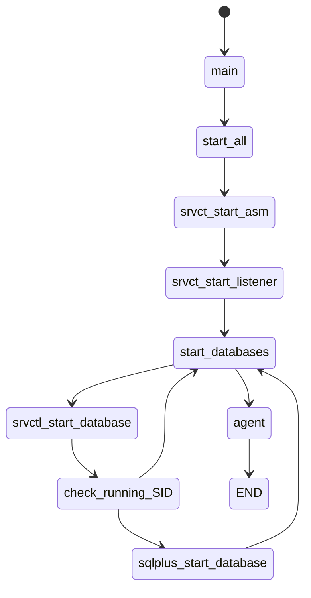
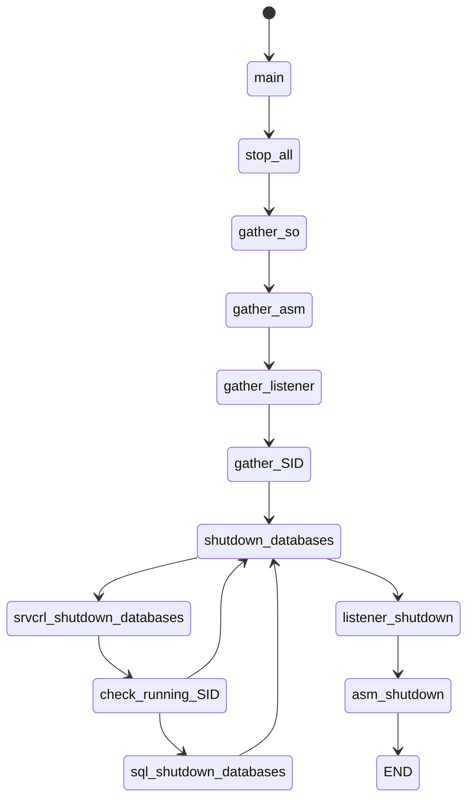

##Start / Stop all services in a Standalone oracle server 
 Role  standalone_stop_start wich sould be able to stop/start all the services running in a oracle standalone server

### Requires
 - directory /etc/ansible/facts.d should exsist and be writable by the ansible remote user  at remote host 
 - env:     remote host as appears on inventory file 
 - operation:  action to be done [start|stop]
 - req:     number of identification, this is used by the blackout 
##  Role explanation
-main.yaml:  This playbook is a simple pipe one wich would redirect the flow to the stop or start playbooks depending based on  on the action variable 
### Start  process 

### STop process  

 ## Files tree
<pre>
 Root
   |
   |- vars:
        |- main.yaml              Oracle team values for all configurations
   |
   |- files
   |
   | - roles
         |
         | standalone_stop_start              Role wich starts/stop all services on a alone oracle database server 
             |
             | scripts:
                | -create_facts.sh          Scritp wich creates the local facts related to running oracle services
             |
             | tasks   
                |
                | - agent.yaml                   Playbook which manages the OEM agent
                | - asm_shutdown                 Playbook which shutdowns the asm
                | - asm_start                    Playbook which starts the start
                | - check_running_SID            Playbook which checks if database is alive 
                | - databases_shutdown           Playbook which stops all databases running at the server 
                | - databases_start              Playbook which starts all active databases at teh server 
                | - gather_ASM.yaml              Playbook which gathers ASM info
                | - gather_SID.yaml              Playbook which gathers database info
                | - listener-shutown             Playbook which stops all the listeners at the server 
                | - listener_start               Playbook which starts all the active listeners 
                | - gather_so.yaml               Playbook which registers the Operating System info 
                | - sqlplus_db_shutdown          Playbook which stops one database trouhth  sqlplus command
                | - sqlplus_db_start             Playbook which stops one database trouhth  sqlplus command
                | - srvctl_db_shutdown           Playbook which stops one database trouhth  srvctl command
                | - srvctl_db_start              Playbook which stops one database trouhth  sqlplus command              
                | - gather_SID.yaml              Playbook which gathers database info
                | - gather_listener              Playbook which gathers listener info
                | - start_all                    Playbook which executes the start
                | - stop_all                     Playbook which executes the stop
</pre>